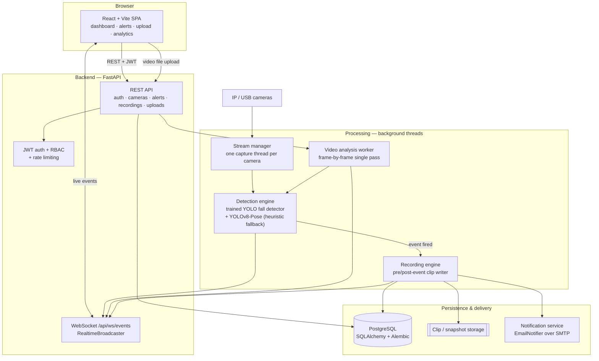

<div align="center">

# SentinelCam

**AI-powered fall detection and video surveillance platform — live multi-camera monitoring,
offline video analysis, and realtime alerts, built on YOLO computer vision with a
production-oriented full-stack architecture.**

[](https://github.com/longlivewama/SentinelCam/actions/workflows/ci.yml)
[](LICENSE)
[](https://www.python.org/)
[](https://fastapi.tiangolo.com/)
[](https://react.dev/)
[](https://www.postgresql.org/)
[](https://docs.docker.com/compose/)
[](https://docs.ultralytics.com/)
[](#testing)

</div>

---

## Table of contents

- [Overview](#overview)
- [Features](#features)
- [Architecture](#architecture)
- [Tech stack](#tech-stack)
- [Project structure](#project-structure)
- [Quick start](#quick-start)
- [Local development (without Docker)](#local-development-without-docker)
- [Configuration](#configuration)
- [Testing](#testing)
- [Performance](#performance)
- [Machine learning: models & datasets](#machine-learning-models--datasets)
- [Engineering notes & design decisions](#engineering-notes--design-decisions)
- [Security](#security)
- [Roadmap](#roadmap)
- [Known limitations](#known-limitations)
- [Production deployment](#production-deployment)
- [Troubleshooting](#troubleshooting)
- [Contributing](#contributing)
- [License](#license)

---

## Overview

Falls are one of the leading causes of injury-related hospitalisation for older adults, and in
care homes, hospitals and industrial sites the cost of a fall is driven far less by the fall
itself than by **how long the person lies there before anyone notices**. Camera coverage in those
buildings is usually already in place — what is missing is something watching the feed.

SentinelCam is that layer. It ingests video from IP/USB cameras (or from an uploaded file),
runs pose-based computer vision over the frames, and when it detects a fall it does the three
things a human operator would: records a clip of what just happened, raises an alert in the
dashboard in realtime, and emails the on-call recipients.

**How it works, end to end:**

1. A camera stream (or an uploaded video) is decoded frame by frame.
2. Each processed frame goes through a **fine-tuned YOLOv8 fall detector** — a single-class model
   trained for this project on 11k images (see [the model card](ml/MODEL_CARD.md)) — which locates
   fallen people directly. A YOLOv8 pose model runs alongside it for person counting and for the
   fallback heuristic.
3. A single frame never raises an alert. A detection must **persist for the same tracked subject**
   before an event fires (0.6 s for the trained model, 1.2 s of sustained on-ground posture for the
   heuristic fallback), so bending down or sitting doesn't trigger it, and one bad frame can't
   either.
4. A firing event snapshots a rolling pre-event buffer, appends post-event frames, and writes a
   playable MP4 clip plus a still snapshot.
5. The event is persisted — with its **position in the footage**, its confidence, and which
   detector produced it — pushed to the browsers entitled to see it over a WebSocket, and emailed out.
6. Operators review, play back and acknowledge alerts from the web UI.

The same detection code path serves both live cameras and uploaded files — only the frame source
and the timeline differ — which is what keeps the "analyse this video" feature honest: it is the
production detector running, not a separate demo path.

> **Scope note.** This is an engineering project, **not a certified medical or safety device**.
> The trained detector scores mAP@50 0.877 on a held-out test split of stills, but measured on
> video it finds 90% of falls while raising roughly **574 false alerts per hour of ordinary
> activity** — good enough to help a human review footage, not good enough to alert unattended.
> That result, how to reproduce it, and why no threshold fixes it are under
> [Known limitations](#known-limitations); the rest is in
> [`ml/MODEL_CARD.md`](ml/MODEL_CARD.md). Read both before any operational use.

---

## Features

### Detection & video

| Feature | Status |
|---|---|
| Live multi-camera monitoring (RTSP IP cameras and USB devices) | ✅ |
| MJPEG live stream, one capture connection shared across all viewers | ✅ |
| Pose-based fall detection with a sustained-posture gate | ✅ |
| Additional heuristic detectors: violence, crowd density, abandoned object | ✅ (heuristics — see [notes](#engineering-notes--design-decisions)) |
| Automatic clip recording with a ~3 s pre-event rolling buffer | ✅ |
| Person tracking + bounding-box annotation on fall clips from uploaded video | ✅ (uploads only — see [notes](#known-limitations)) |
| Snapshot capture attached to every event | ✅ |
| Offline video upload with drag-and-drop, client-side validation and progress tracking | ✅ |
| Server-side analysis of uploaded video through the same detector | ✅ |
| Per-event confidence scores | ✅ |
| Ranged video playback and clip download | ✅ |

### Application platform

| Feature | Status |
|---|---|
| JWT authentication — signup, login, logout, forgot/reset password | ✅ |
| Role-based access control: `admin` / `operator` / `viewer`, enforced server-side | ✅ |
| Protected frontend routes + role-aware navigation | ✅ |
| Realtime updates over WebSocket (alerts, camera status, upload progress) | ✅ |
| Email notifications (SMTP), with SMS/WhatsApp notifier interfaces stubbed | ✅ / 🧩 |
| Alert acknowledgement workflow | ✅ |
| Dashboard analytics — event counts, trends, per-camera breakdown | ✅ |
| Admin user management (create, disable, change role) | ✅ |
| System status page (database, detector, storage) | ✅ |
| Per-IP rate limiting on all sensitive auth endpoints | ✅ |
| Alembic database migrations, including a data-preserving RBAC migration | ✅ |
| Responsive UI with toast notifications and graceful error states | ✅ |
| One-command Docker Compose stack (Postgres + backend + frontend + mail catcher) | ✅ |
| CI pipeline: lint, backend, frontend, end-to-end and dependency-audit jobs | ✅ |

---

## Architecture



**Request/authentication path.** JWT (24 h expiry) with bcrypt-hashed passwords. Password reset
uses one-time SHA-256-hashed tokens emailed to the user — the raw token is never persisted. Every
JSON API route takes the session token as an `Authorization: Bearer` header and **only** as a
header: a `?token=` query parameter is refused, so a credential that leaks into a URL cannot be
replayed against the API.

Browsers cannot attach a custom header to ``, `<video src>` or an `<a href>` download, so
the four media endpoints have to take a credential in the URL. What travels there is **not** the
session token. The client calls `POST /api/{recordings|video-uploads|cameras}/{id}/media-token`
first and gets a **media token**: scoped to that one resource, expiring in
`MEDIA_TOKEN_EXPIRE_SECONDS` (default 300 s), carrying no role, refused as a bearer credential
anywhere, and refused by every media endpoint except the one it names. A media token recovered
from an access log buys the ability to re-watch the clip whose URL it came from, for a few
minutes. On top of that, `app/core/logging_utils.py` redacts `token=` out of every log record in
the process, so neither credential is written down in the first place.

The realtime WebSocket still authenticates with the session token in its handshake URL — a
long-lived socket cannot re-authenticate per message, and it is opened by the native WebSocket
API, which has no header either. It is covered by the same log redaction, and it rejects media
tokens outright. See [Known limitations](#known-limitations).

**Authorization.** Two layers. *Role* gates, enforced by FastAPI dependencies (`require_admin`,
`require_operator`) on every mutating endpoint: `admin` has full access including user management;
`operator` manages cameras, acknowledges alerts and analyses video; `viewer` is read-only plus
upload/analysis. And *row-level* scoping (`app/core/scoping.py`), which decides who may see a
given alert, clip or realtime event: anything derived from a user's uploaded video belongs to that
user, anything from a shared camera is visible to every authenticated user, and operators see
everything. The frontend's route guards and hidden buttons are a UX convenience, **not** the
security boundary.

**Streaming.** Each camera gets one lazily-started background thread owning the
`cv2.VideoCapture` connection. It decodes frames and keeps the latest JPEG in a shared buffer,
which `/stream` serves as `multipart/x-mixed-replace` to any number of simultaneous viewers —
without opening a second capture connection per viewer.

**Recording.** That same thread keeps a rolling buffer of the last ~3 seconds of raw frames. When
a detector fires, the recording engine snapshots the buffer, appends ~3 more seconds of live
frames, and writes the combined clip (`avc1`/H.264, falling back to `mp4v`), records it in the
database, and dispatches an email alert with the snapshot attached. Events store which detector
fired them and, for uploads, the fall's **position in the source footage** — so the results screen
can seek the video to the moment itself rather than showing the time the analysis ran.

**Realtime.** An in-process pub/sub broadcaster over a single WebSocket endpoint lets background
worker threads push `alert.created`, `camera.status`, `upload.progress` and `upload.completed`
events to connected tabs instantly — no polling. Delivery is **scoped per subscriber**, using the
same ownership rule as the REST API: camera events go to everyone, upload events only to the
uploader and to operators. The socket also closes itself when the token it was opened with
expires, since a long-lived connection cannot re-authorize per message the way an HTTP request
can.

---

## Tech stack

| Layer | Technologies |
|---|---|
| **Frontend** | React 18, Vite 5, Tailwind CSS 3, Zustand, React Router, Axios |
| **Backend** | Python 3.11, FastAPI, Uvicorn, Pydantic v2, SQLAlchemy 2.0, Alembic |
| **Database** | PostgreSQL 16 |
| **Computer vision** | Ultralytics YOLOv8 (pose + object detection), OpenCV |
| **ML runtime** | PyTorch (training), ONNX Runtime (inference) |
| **Realtime** | WebSocket (FastAPI/Starlette) |
| **Auth** | JWT (python-jose, HS256), bcrypt via passlib |
| **Testing** | pytest, Vitest + Testing Library, Playwright |
| **Tooling / CI** | Docker & Docker Compose, nginx, GitHub Actions, ruff, ESLint |

---

## Project structure

```
SentinelCam/
├── backend/                  FastAPI service
│   ├── app/
│   │   ├── api/routes/       auth, cameras, alerts, recordings, video_uploads,
│   │   │                     analytics, admin, realtime, system
│   │   ├── core/             security, RBAC dependencies, rate limiting
│   │   ├── models/           SQLAlchemy models (user, camera, event, recording, …)
│   │   ├── schemas/          Pydantic request/response schemas
│   │   ├── services/         detection engine, stream manager, recording engine,
│   │   │                     video analysis, realtime broadcaster, notifications
│   │   ├── config.py         environment-driven settings
│   │   └── main.py           application entrypoint
│   ├── alembic/              database migrations
│   ├── tests/                69 backend tests (pytest, real PostgreSQL)
│   └── Dockerfile
├── frontend/                 React + Vite single-page app
│   ├── src/
│   │   ├── pages/            dashboard, cameras, alerts, recordings, upload,
│   │   │                     analytics, admin users, auth pages
│   │   ├── components/       route guards, camera tiles, charts, modals, toasts
│   │   ├── store/            Zustand stores (auth, toasts, alert badge)
│   │   ├── lib/              realtime client, formatting, upload validation
│   │   └── api/              Axios client with auth interception
│   ├── nginx.conf            production static-serving config
│   └── Dockerfile
├── ml/                       standalone ML pipeline (not imported by the app)
│   ├── detector/             YOLO fall-detector: dataset download, analysis,
│   │                         preparation and training scripts
│   ├── scripts/              keypoint-feature dataset builders
│   ├── exported/             committed model artifact + metadata (ONNX)
│   ├── train.py evaluate.py export.py
│   └── README.md             full methodology, evaluation and honest caveats
├── e2e/                      Playwright suite driving the real Docker stack
│   ├── tests/                auth, cameras, alerts/recordings, upload
│   └── fixtures/             test media
├── .github/workflows/ci.yml  backend · frontend · e2e · dependency-audit jobs
├── docker-compose.yml        Postgres + backend + frontend + Mailpit
└── .env.example              documented configuration template
```

---

## Quick start

### Prerequisites

- [Docker](https://docs.docker.com/get-docker/) and Docker Compose

That's it — Postgres, the backend, the built frontend and a mail catcher all come up together.

### 1. Clone

```bash
git clone https://github.com/longlivewama/SentinelCam.git
cd SentinelCam
```

### 2. Configure (optional)

Every value has a working local default. To override any of them:

```bash
cp .env.example .env      # then edit as needed
```

Set a real `JWT_SECRET_KEY` for anything beyond a local trial:

```bash
python3 -c "import secrets; print(secrets.token_hex(32))"
```

### 3. Start the stack

```bash
docker compose up --build
```

### 4. Create the first admin user

In a second terminal, once the stack is healthy:

```bash
docker compose exec backend python seed_admin.py
```

### 5. Open the app

| Service | URL |
|---|---|
| Web UI | http://localhost:5173 |
| API + interactive docs | http://localhost:8000 · http://localhost:8000/docs |
| Mailpit (catches alert & password-reset email) | http://localhost:8025 |

Log in, then either add a camera (an `rtsp://…` URL, or a device index like `0` for a USB
webcam) from the **Cameras** page, or go straight to **Upload** and analyse a video file — no
camera hardware required.

> **Camera access from inside Docker** is host-OS dependent. Linux can pass a USB device through
> with `devices:` in `docker-compose.yml`; Docker Desktop on macOS/Windows generally cannot. RTSP
> IP cameras work over the network regardless. For local USB webcam testing, run the backend
> outside Docker (below).

Recordings, snapshots and uploads persist in named Docker volumes across restarts.
`docker compose down -v` wipes them along with the database.

---

## Local development (without Docker)

**Prerequisites:** Python 3.11+, Node 20.18+ (Node 22 recommended — jsdom 30 needs a recent
Node to run the frontend tests), and a local PostgreSQL server.

```bash
# 1. Databases
createdb sentinelcam
createdb sentinelcam_test          # only needed for the backend test suite

# 2. Backend
cd backend
python3 -m venv venv && source venv/bin/activate
pip install -r requirements.txt
cp .env.example .env               # fill in DATABASE_URL, JWT_SECRET_KEY, SMTP_* …
alembic upgrade head               # apply the schema
python seed_admin.py               # create the first admin user
uvicorn app.main:app --reload      # http://localhost:8000  (docs at /docs)

# 3. Frontend (separate terminal)
cd frontend
npm install
cp .env.example .env               # VITE_API_URL=http://localhost:8000
npm run dev                        # http://localhost:5173
```

### Database migrations

Schema changes are managed with Alembic; `alembic upgrade head` is the production migration path.

```bash
cd backend
alembic upgrade head                                      # apply pending migrations
alembic revision --autogenerate -m "describe the change"  # after changing a model
```

`Base.metadata.create_all()` also runs once on startup as a convenience for fresh dev databases —
it only ever *adds missing tables* and never alters existing ones, so it is a safety net, not a
substitute for migrations against a database that already holds data.

---

## Configuration

All configuration is read from the environment. Never hardcode credentials — every real `.env`
file is gitignored, and only `.env.example` templates are committed.

| Variable | Purpose |
|---|---|
| `DATABASE_URL` | PostgreSQL connection string |
| `JWT_SECRET_KEY` | JWT signing secret. The app **refuses to start** if left at its insecure default while `ENVIRONMENT=production` |
| `MEDIA_TOKEN_EXPIRE_SECONDS` | Lifetime of the short-lived, resource-scoped token the media endpoints accept in a URL (default `300`) |
| `CORS_ORIGINS` | Comma-separated allowed frontend origins |
| `FRONTEND_URL` | Base URL used to build links in emails (e.g. password reset) |
| `NOTIFICATION_CHANNELS` | Comma-separated enabled channels (`email` works out of the box) |
| `SMTP_*`, `ALERT_RECIPIENTS` | Email delivery configuration |
| `UPLOADS_DIR`, `MAX_UPLOAD_SIZE_MB`, `ALLOWED_VIDEO_EXTENSIONS` | Video upload limits |
| `MAX_UPLOAD_STORAGE_PER_USER_MB` | Per-account storage quota (0 disables it) |
| `MAX_CONCURRENT_VIDEO_ANALYSES` | Upper bound on simultaneous upload analyses; the rest queue |
| `FALL_DETECTOR_MODEL_PATH` | The trained fall detector. Defaults to the committed artifact; empty forces the pose heuristic |
| `FALL_DETECTION_MODE` | `auto` \| `model` \| `heuristic` \| `hybrid` — see [Machine learning](#machine-learning-models--datasets) |
| `FALL_DETECTOR_MIN_CONFIDENCE`, `FALL_DETECTOR_MIN_SUSTAINED_SECONDS` | Detection threshold and how long a detection must persist before it alerts |
| `FALL_CLASSIFIER_MODEL_PATH` | Optional path to the earlier ONNX keypoint classifier (empty = off, the default) |
| `AUTH_*_MAX_REQUESTS` / `AUTH_*_WINDOW_SECONDS` | Per-IP rate limits on signup, login, forgot-password and reset-password |
| `VITE_API_URL` *(frontend)* | Backend base URL; the WebSocket URL is derived from it automatically |

The full commented list lives in [`.env.example`](.env.example),
[`backend/.env.example`](backend/.env.example) and `frontend/.env.example`.

---

## Testing

**618 automated tests across three suites**, all currently passing, plus a five-job CI pipeline.

| Suite | Count | What it covers |
|---|---:|---|
| **Backend** (pytest) | **516** | Security primitives, media-token scoping and expiry, log redaction, pagination (ordering, tiebreakers, ownership, IDOR), fall-detection logic (both the trained-model gate and the pose heuristic), the committed model artifact's contract, cross-user isolation, auth & RBAC, cameras, alerts, recordings, upload validation, HTTP Range handling, realtime delivery scoping, analytics, rate limiting, Alembic migrations + schema-drift detection, email notifier, the ML validation framework, and an end-to-end video analysis over a real decoded video |
| **Frontend** (Vitest + Testing Library) | **108** | Auth pages, route guards, media-token minting and retry, pagination controls and server-side filtering, upload workflow (drag-drop, validation, progress, delete), the results screen's in-video timestamps and detector labelling, system status including the model-fallback warning, dashboard, formatting helpers, Zustand stores |
| **End-to-end** (Playwright) | **18** | Real Chromium against the real Docker Compose stack — signup, login, logout, forgot/reset password (reading the actual email out of Mailpit's API), camera CRUD + RBAC, alert acknowledgement, recording playback (the clip is decoded in the browser, not merely mounted), and the full upload → process → view-results workflow |
| **Docker** | 4 services | `postgres`, `backend`, `frontend`, `mailpit` — all healthy under `docker compose up` |

```bash
# Backend — runs against a real PostgreSQL database, not a mock
cd backend && source venv/bin/activate
createdb sentinelcam_test        # one-time
pytest
ruff check .

# Frontend
cd frontend
npm run lint && npm run test && npm run build

# End-to-end (brings the Docker stack up, seeds fixtures, runs, tears down)
cd e2e
npm install
npx playwright install --with-deps chromium   # one-time
npm test
```

Backend tests deliberately run against real Postgres rather than a sqlite substitute — the app
relies on Postgres-specific behaviour (boolean filters, timezone-aware timestamps) in enough
places that sqlite would give false confidence.

No coverage percentage is published here, because none has been measured.

---

## Performance

Measured end to end on the live Docker stack — a real upload of the real fall video through the
real API, timed to `status=completed`. Host: Apple M5, backend container limited to 4 CPUs / 4 GB.

Test video: 576x1024, 30 fps, 878 frames, **29.27 s**.

| | Before | After |
|---|---:|---:|
| Wall clock | 77.57 s | **36.33 s** (median of 5) |
| Effective throughput | 11.3 frames/s | **24.2 frames/s** |
| vs realtime | 2.65x slower | 1.24x slower |
| Falls detected | 2 (t=1.67 s / 0.70, t=20.00 s / 0.74) | **identical** |
| Persons detected | 3 | **identical** |

**53% faster, with byte-identical detection output** — inference is untouched.

The win is not in the model. Profiling showed clip encoding was ~70% of the wall clock: the codec
ladder in `recording_engine.open_writer` preferred VP9, and libvpx-vp9 through OpenCV's
`VideoWriter` has no way to set a speed/deadline, so it ran at its slow default. VP8 sits ahead of
it now, on measurement rather than preference — encoding one 180-frame clip in the reference
container:

| Codec | Encode | Bytes | PSNR mean | PSNR min | SSIM |
|---|---:|---:|---:|---:|---:|
| `avc1` (H.264) | does not open — the stock wheel ships FFmpeg without libx264 | | | | |
| `vp09` (VP9) | 26.6 s | 4 938 089 | 39.91 dB | 38.37 dB | 0.9722 |
| **`VP80` (VP8)** | **5.6 s** | **4 062 534** | **39.64 dB** | **38.92 dB** | **0.9712** |
| `mp4v` | 0.4 s | 1 580 629 | 38.65 dB | 37.83 dB | 0.9641 |

4.8x faster, 18% smaller, 0.27 dB below VP9 on mean PSNR — well inside the ~1 dB a viewer could
notice — and with a *better* worst-frame PSNR. Both are equally playable in every browser this
targets. `mp4v` stays last regardless of speed: no current browser can decode it, which was a
real incident here.

**Not claimed: this is not realtime.** 36.3 s to analyse 29.3 s of footage is 1.24x slower than
realtime. A cold container adds ~37 s of one-time model loading to the first upload after a
restart. What remains is inference — roughly evenly split between the pose model (13.6 s) and the
fall detector (10.6 s) over 176 processed frames — and it cannot be moved to a GPU in the Linux
container this ships in: MPS is macOS-only and there is no CUDA device.

---

## Machine learning: models & datasets

The `ml/` directory is a **standalone training pipeline**. It is not imported by the running
backend — it produces the model artifacts the backend loads.

### The production fall detector

**`ml/exported/fall_detector_v1.pt` — YOLOv8n, single class `Fall`, 5.4 MB.** This is the model
the application runs. Full details, honest limitations and reproduction steps live in
**[`ml/MODEL_CARD.md`](ml/MODEL_CARD.md)**; the short version:

| | Precision | Recall | mAP@50 | mAP@50-95 |
|---|---:|---:|---:|---:|
| Validation (2,189 images) | 0.812 | 0.710 | 0.826 | 0.528 |
| **Held-out test (2,176 images)** | **0.846** | **0.800** | **0.877** | **0.557** |

Trained for 80 epochs (18.5 h on Apple Silicon) from COCO-pretrained weights on a public Roboflow
fall-detection dataset (CC BY 4.0), prepared into 11,074 train / 2,189 val / 2,176 test images.
Test scores sit slightly *above* validation across all four metrics — no sign of overfitting, and
307 near-duplicate images were moved out of val/test into train first so the test split is
genuinely held out.

Two preparation decisions shape what this model is, and both came out of a dataset analysis run
*before* any training ([`ml/reports/fall_detector_dataset_analysis.md`](ml/reports/fall_detector_dataset_analysis.md)):

- **The raw export's second class, `Person`, was dropped.** Not one image of 15,439 contained both
  a `Fall` and a `Person` box — `Person` was entirely PASCAL VOC, `Fall` entirely separate fall
  datasets. A two-class detector could have scored well by learning *which dataset an image came
  from*. Dropping `Person` removes the shortcut and repurposes those 6,887 VOC images as background
  negatives: examples of upright people that must not fire.
- **Augmentation follows from the task, not from defaults.** This class is defined by orientation
  relative to gravity, so vertical flips are disabled outright and rotation is capped at 5°;
  anything more would rotate standing people into lying poses while keeping the "not a fall" label.
  Mosaic is kept at 1.0 precisely *because* no source image contains both a fall and an upright
  person — compositing four images synthesises the co-occurrence the dataset structurally lacks.

**Known limitations, stated plainly:** every metric above is **per-frame on stills**. The
operational quantities — falls detected per fall that happened, false alerts per hour of ordinary
footage, detection latency — are **not measured**, and the source data is not care-home footage.
See the model card's Limitations section in full before deploying it anywhere real.

**Frame-level metrics are not operational evidence.** `ml/validation/` implements the video-level
evaluation that would produce it: it drives the real production inference path over labelled clips
and reports incident recall, incident precision, false alerts/hour, latency and a sweep over the
two thresholds that govern the trade-off. **Evaluation framework ready; real video validation
pending labelled footage** — no labelled corpus exists yet, so no video-level number has been
produced, and `FALL_DETECTOR_MIN_CONFIDENCE` / `FALL_DETECTOR_MIN_SUSTAINED_SECONDS` remain
reasoned defaults rather than measured ones. See [`ml/validation/README.md`](ml/validation/README.md).

### Integration

```
frame ─▶ fall_object_detector.detect()   YOLO inference, conf ≥ 0.4
      ─▶ ModelFallDetector.update()       tracking + sustain gate + debounce
      ─▶ Event(detector, confidence, video_timestamp_seconds)
```

| Setting | Default | Effect |
|---|---|---|
| `FALL_DETECTOR_MODEL_PATH` | `ml/exported/fall_detector_v1.pt` | Empty forces the pose heuristic |
| `FALL_DETECTION_MODE` | `auto` | `auto` \| `model` \| `heuristic` \| `hybrid` |
| `FALL_DETECTOR_MIN_CONFIDENCE` | `0.4` | Per-box confidence floor |
| `FALL_DETECTOR_MIN_SUSTAINED_SECONDS` | `0.6` | How long a detection must persist |

`auto` runs the trained model when it loads and falls back to the pose heuristic when it doesn't,
so a deployment without the checkpoint still detects falls. That fallback is **never silent**:
`GET /api/system/status` and the System Status page report both the configured and the *active*
mode, and flag the degradation explicitly.

Inference costs ~120 ms per 640 px frame on CPU. For live cameras this is a *third* model per
processed frame alongside pose and object detection — budget for it, or raise
`DETECTION_FRAME_STRIDE`.

### Clip annotation (uploads)

A fall clip written by the upload analyser carries a box over the person the fall belongs to. This
sits strictly *downstream* of everything above — it cannot create, suppress, retime or re-score a
fall — and it adds no inference, because it consumes the pose boxes and `Fall` boxes the pipeline
has already produced for each processed frame.

```
processed frame ─▶ PersonTracker           pose boxes  → temporary track ids
                ─▶ PersonTracker           Fall boxes  → fall regions
fall event      ─▶ associate()             containment + IoU + centre + continuity
                ─▶ AnnotationPlan          the subject's boxes across the clip window
clip write      ─▶ BoxTimeline             interpolated between real observations only
                ─▶ FALL DETECTED / ID n | 0.74
```

Three properties are deliberate:

- **The box moves.** Inference runs every `VIDEO_ANALYSIS_FRAME_STRIDE`-th frame, so a clip has a
  real observation ~6 times a second; frames in between are interpolated between two real
  sightings. Outside the observed span, or across a gap longer than 0.75 s, nothing is drawn.
- **Association can refuse.** With several people on screen only the one who fell is boxed, and a
  candidate that is merely near the fall — or an even split between two of them — yields no track
  id at all. The clip then shows the detector's own region as a dashed box marked `UNMATCHED`.
- **Track ids are object-tracking handles, nothing more.** They live for a few seconds inside one
  analysis, are never persisted, and are never compared across videos. No face or identity
  recognition of any kind is involved.

`backend/app/services/detection/{person_tracker,track_fall_association,annotated_clip_renderer,fall_annotation}.py`.

### The earlier keypoint classifier (secondary, disabled by default)

`ml/exported/fall_classifier_v1.onnx` is a 10-feature keypoint MLP from an earlier iteration. It is
**not** the production detector and has a much weaker standing: its 1.000 test metrics are flagged
in [`ml/reports/eval_report.md`](ml/reports/eval_report.md) as likely domain-shortcut artifacts. It
was only ever wired in as a confidence nudge on top of the heuristic's gate, never as a source of
truth, and remains off unless `FALL_CLASSIFIER_MODEL_PATH` is set.

### What is and is not in this repository

| Artifact | In Git? | Why |
|---|---|---|
| Detector + classifier pipeline source (`ml/detector/`, `ml/scripts/`) | ✅ | The reproducible part |
| **Trained fall detector** (`ml/exported/fall_detector_v1.pt` + metadata) | ✅ | 5.4 MB — the actual deliverable, so a fresh clone runs the real model |
| Detector metrics: results CSV, PR/F1 curves, confusion matrices | ✅ | So the model card's numbers are checkable without retraining |
| Exported keypoint classifier (`ml/exported/fall_classifier_v1.*`) | ✅ | Small, and the deliverable of that earlier pipeline |
| Training **datasets** (`ml/data/…`) | ❌ | Large, redistributable only under their own licences — re-fetch with the download scripts |
| Training **runs & checkpoints** (`ml/runs/`) | ❌ | ~16 MB per run of per-epoch checkpoints and batch mosaics; the selected artifact is promoted to `ml/exported/` |
| Training **logs** (`ml/logs/`) | ❌ | Machine-local noise |
| Auto-downloaded YOLO base weights (`*.pt` at repo root) | ❌ | Fetched on demand by Ultralytics |

The committed weights are fine-tuned from **AGPL-3.0** Ultralytics COCO weights on a **CC BY 4.0**
dataset — see [`NOTICE.md`](NOTICE.md) before any commercial use or redistribution.

Reproduce the model with `download_dataset.py` → `analyze_dataset.py` → `prepare_dataset.py` →
`train.py` in `ml/detector/` (a stratified smoke-test subset is available for fast iteration). Do
not overwrite `fall_detector_v1.pt`; promote a retrained model as `v2` alongside it.

---

## Engineering notes & design decisions

Three of the four live-camera detectors were specified against research-grade models that require
specific datasets and substantial GPU time (RWF-2000 for violence, ShanghaiTech/CSRNet for crowd
density, DeepSORT for tracking). Rather than ship an untrained model behind a confident-sounding
name, each was implemented as a practical, honestly-scoped equivalent that satisfies the same
interface and can be swapped later **without touching the rest of the system**:

| Detector | Research-grade approach | What is actually implemented | Upgrade path |
|---|---|---|---|
| **Fall** | YOLOv8-Pose, 3-signal heuristic | Pose heuristic (aspect ratio / keypoint alignment / hip velocity) gated by a sustained on-ground-posture requirement (≥1.2 s continuous, not a single frame) to reject bending and sitting, plus an optional trained classifier as a corroborating signal | Retrain on real footage; add the YOLO fall detector from `ml/detector/` |
| **Violence** | CNN+LSTM trained on RWF-2000 | Heuristic over the same pose keypoints: erratic high-velocity wrist/elbow motion between people in close proximity | Swap in a trained temporal model via `VIOLENCE_MODEL_PATH` |
| **Crowd counting** | CSRNet density-map estimation | YOLOv8 person-class detection and count, smoothed over frames, thresholded per camera | Swap in CSRNet for very dense or occluded scenes |
| **Abandoned object** | YOLO + DeepSORT | YOLO object detection plus a small centroid tracker | Swap in DeepSORT/ByteTrack for robust ID persistence through occlusion |

Other decisions worth calling out:

- **One capture thread per camera, not per viewer** — the naive implementation opens a new
  `VideoCapture` per connected browser and collapses at three viewers.
- **Sustained-posture gating over per-frame classification** — a single-frame "on the ground"
  signal fires constantly on people bending, sitting and crouching. The time gate is what makes
  the alert stream usable.
- **Shared detection path for live and uploaded video** — the upload feature runs the production
  detector against the file's own timeline, so it is a genuine test of the real pipeline.
- **Notifier interface with real stubs** — `SmsNotifier` and `WhatsAppNotifier` log an explicit
  "not configured" warning rather than silently no-op, so wiring a real provider later is a config
  change plus one class, not a call-site rewrite.

---

## Security

- **Secrets live in environment variables only.** No credential is committed; every real `.env`
  is gitignored and only documented `.env.example` templates ship with the repository.
- **Production start-up guard.** The backend refuses to boot with `ENVIRONMENT=production` while
  `JWT_SECRET_KEY` is still the insecure default.
- **Authentication.** JWT with bcrypt-hashed passwords. Password-reset tokens are single-use and
  stored only as SHA-256 hashes — the raw token exists solely in the email.
- **Authorization.** Role checks are enforced server-side on every mutating endpoint; the frontend
  guards are UX, not security.
- **Rate limiting.** Per-IP sliding-window limits on signup, login, forgot-password and
  reset-password, all tunable via environment variables.
- **Dependency auditing.** `pip-audit` and `npm audit` run on every CI build (informational, so a
  new advisory surfaces for review rather than silently blocking unrelated work).
- **For production deployments,** use a managed secret store (AWS Secrets Manager, GCP Secret
  Manager, Vault, or your platform's equivalent) rather than `.env` files on disk, terminate TLS at
  a reverse proxy, and restrict `CORS_ORIGINS` to your real frontend origins.

Found a vulnerability? Please report it privately — see [SECURITY.md](SECURITY.md). Do not open a
public issue for security reports.

---

## Roadmap

Recently completed:

- [x] **Trained YOLO fall detector integrated as the primary detector**, with a published
      held-out evaluation — see [`ml/MODEL_CARD.md`](ml/MODEL_CARD.md).
- [x] **In-video fall timestamps persisted**, so uploaded-video results seek to the exact moment
      of each detection rather than showing a wall-clock time.
- [x] **Row-level authorization** on alerts, recordings, analytics and the realtime channel.
- [x] **Video-level validation framework** — [`ml/validation/`](ml/validation/README.md) evaluates
      the real production pipeline per *incident* rather than per frame, with a documented
      matching rule, a threshold sweep and hard-negative attribution. It produces no numbers yet:
      it is waiting on labelled footage, not on code.

Planned:

- [ ] **Video-level model evaluation** — the largest remaining gap. The *framework* is now
      built and tested ([`ml/validation/`](ml/validation/README.md)): it drives the real
      production inference path over labelled clips and reports incident recall, incident
      precision, false alerts/hour, latency and a threshold sweep. What is missing is the
      **labelled fall video corpus** — 20–50 clips, roughly half falls and half hard negatives.
      Until those exist, every published metric remains per-frame on stills and the operational
      numbers are unmeasured. *Evaluation framework ready; real video validation pending
      labelled footage.*
- [ ] **Hard-negative validation** — evaluate against realistic floor-level activity (sit-ups,
      crouching, a child playing, someone lying on a sofa), none of which the current test split
      contains. The evaluator groups every false alert by the activity that produced it, so this
      lands with the corpus above rather than needing separate tooling.
- [ ] **Inference performance** — batched frame processing and optional GPU acceleration for
      faster analysis of long recordings. Profiling showed inference is no longer the dominant
      cost (clip encoding was, and is fixed — see [Performance](#performance)); the remaining
      ~23 s per 29 s clip is split roughly evenly between the pose model and the fall detector,
      and MPS/CUDA are unavailable inside the Linux container the stack actually ships.
- [ ] **Horizontally scalable realtime** — move the rate limiter and event broadcaster to Redis so
      the backend can run multiple workers or instances.
- [x] **Pagination** on the alert, recording, upload and admin-user listings — done. Offset
      paging at the database with a `{items, page, page_size, total, pages}` envelope, ownership
      filtering applied in SQL before the count, and a primary-key tiebreaker on every sort so a
      row cannot appear on two pages. See `app/core/pagination.py`.
- [ ] **Richer analytics** — per-camera heatmaps, time-of-day distributions, exportable reports.
- [ ] **More notification channels** — SMS and WhatsApp providers behind the existing interfaces.
- [ ] **Observability** — structured logging, metrics and health dashboards.
- [ ] **Model version management** — track, compare and roll back deployed detector versions.
      The artifact + metadata sidecar convention (`fall_detector_v1.pt` alongside
      `fall_detector_v1.metadata.json`) is the groundwork; a registry and a UI are not.
- [ ] **Deployment reference** — a documented production deploy (managed Postgres, object storage
      for clips, TLS termination).

---

## Known limitations

Stated plainly, because they matter when reading the rest of this document:

1. **The fall detector raises far too many false alerts on ordinary activity.** This is now
   measured rather than suspected. Running the production inference path over 20 labelled clips
   from the [UR Fall Detection Dataset](https://fenix.ur.edu.pl/~mkepski/ds/uf.html) — 10 falls
   and 10 activities of daily living, same rooms, same camera — gives:

   | | |
   |---|---:|
   | Incident recall | 90% (9 of 10 falls) |
   | Median detection latency | 0.66 s |
   | Incident precision | 45% (9 of 20 alerts) |
   | **False alerts / hour of ordinary activity** | **574** |

   Reproduce with `python -m ml.validation.fetch_urfd` then `python -m ml.validation.evaluate`.

   **This is a model limitation, not a tuning problem, and no threshold fixes it.** On the
   non-fall clips the detector emits a `Fall` box on *more* frames than it does on the real falls
   (58% vs 25–47%), at confidences that overlap the true positives (0.85 vs 0.87). Raising the
   confidence floor removes true falls before it removes false ones; lengthening the sustain
   window removes them in the wrong order too, because a person lying down stays down longer than
   a person who has fallen. The published metrics (precision 0.846 / recall 0.800 / mAP@50 0.877)
   remain **per frame, on still images**, and do not survive contact with continuous video of
   ordinary activity.

   The detector finds falls well and is close to useless at ignoring everything else, so **it is
   not fit for unattended alerting.** It is usable as a review aid, where a human sees the clip.
   Fixing it needs retraining with hard negatives, not configuration. See
   [`ml/MODEL_CARD.md`](ml/MODEL_CARD.md).

   The sample is small (20 clips, 1.8 minutes, one dataset, one viewpoint, two rooms, one
   subject), so treat the exact figures as indicative. The direction of the result is not
   subtle enough to be sampling noise.

   **Validation status: evaluation framework ready; independent real-world video validation
   pending labelled footage.** The framework measures ground truth against predicted events with
   temporal matching, and reports TP/FP/FN, precision, recall, F1, a threshold sweep,
   hard-negative analysis, confidence distributions and per-condition breakdowns. What does not
   exist is the corpus: [`ml/validation/README.md`](ml/validation/README.md) specifies the dataset
   needed — falls by direction (forward/backward/sideways) and speed (slow/fast), ten required
   hard-negative activities, and variation across lighting, camera angle, distance, occlusion and
   resolution. `Corpus.missing_coverage()` checks a corpus against that specification
   mechanically, and every report prints what is missing on its own front page. The URFD corpus
   above satisfies **none** of those dimensions, which is why its numbers are labelled indicative
   rather than validated.
2. **The realtime WebSocket still carries the session token in its handshake URL.** The media
   endpoints no longer do — they take a short-lived, resource-scoped media token instead (see
   [Architecture](#architecture)) — but a WebSocket is opened by the native browser API, which
   has no header, and it is long-lived, so it cannot re-authenticate per message the way an HTTP
   request does. Mitigations in place: the socket closes itself at the token's own `exp`, delivery
   is scoped to that identity, media tokens are refused outright, and `token=` is redacted from
   every log record. Residual exposure is narrower than it was for media URLs — a WebSocket URL
   is not a navigation, so it does not enter browser history or generate a `Referer` — but the
   credential is still a full-privilege one in a URL. Closing it properly needs a scoped,
   renewable socket token and reconnect handling on the client.
3. **`HEAD` is not supported on the media endpoints.** They answer `405`, which is FastAPI's
   default for a `GET`-only route rather than anything specific to streaming. Browsers play video
   with ranged `GET`s, so playback is unaffected; a client that probes with `HEAD` first (some
   download managers, some proxies) has to issue a ranged `GET` instead.
4. **Analysis duration varies with machine load, and is not realtime.** Everything here is
   CPU-verified with no GPU requirement, so wall-clock analysis time for a given video depends
   heavily on what else the host is doing — one of six benchmark runs took 54 s where the other
   five took 35–36 s. See [Performance](#performance) for the measured figures and what is left
   in them.
5. **Violence, crowd and abandoned-object detectors are heuristics**, not trained models — a known
   and documented scope boundary, not an accidental gap.
6. **Clip annotation covers uploaded video only; live-camera clips are unannotated.** The upload
   analyser decodes a file with a frame index it can attach observations to, while a camera clip is
   assembled from a rolling buffer that another thread fills at a different cadence with no
   per-frame identity. Annotating those would mean threading frame ids through `stream_manager`,
   which is a change to the realtime capture path rather than to this feature. The annotation layer
   is also only as good as the detector under it: on footage where the model raises a false alert
   (see limitation 1), the honest result is a dashed `UNMATCHED` region, and where the pose model
   never sees the subject at all — a person lying still in the dark — no track id can be offered.
7. **The earlier keypoint classifier's metrics are optimistic** — small, narrow, largely
   synthetic dataset; see [`ml/README.md`](ml/README.md). It is off by default and is not the
   production detector.
8. **Single-process assumptions.** The in-memory rate limiter and realtime broadcaster are
   per-process; multi-worker deployment needs a shared backing store.
9. **E2E coverage boundaries.** The Playwright suite does not cover live-camera streaming (no
   camera hardware in CI) or a genuine ML-detected fall — its upload fixture is deliberately
   person-free so the assertion stays honest. Both were verified manually in a real browser.
10. **Two residual dependency advisories are accepted rather than force-fixed:** `ecdsa` (reachable
   only via ECDSA JWT algorithms; this app uses HS256 exclusively) and `pyasn1` (pinned by
   `python-jose`'s own constraint). Both are documented rather than hidden.
11. **Untested externally:** a real RTSP IP camera (verified against a USB webcam instead), and
   real SMTP delivery (verified against Mailpit).

---

## Production deployment

1. Set `ENVIRONMENT=production` and a real random `JWT_SECRET_KEY` — the app refuses to boot
   otherwise.
2. Run `alembic upgrade head` against the production database as a deploy step; do not rely on
   `create_all`.
3. Run the backend behind a real ASGI configuration (`uvicorn app.main:app --workers N` behind a
   reverse proxy). Note that the in-memory rate limiter and realtime broadcaster are per-process —
   scaling past one worker needs a shared store (see the docstrings in `app/core/rate_limit.py`
   and `app/services/realtime.py`).
4. Serve the frontend build (`frontend/dist/`) from a static host or CDN, with `VITE_API_URL`
   baked in at build time.
5. Configure real SMTP credentials for `NOTIFICATION_CHANNELS=email`, and set `CORS_ORIGINS` to
   your real frontend origins.

### External services you will need for full functionality

| Dependency | Needed for | Without it |
|---|---|---|
| SMTP credentials | Alert and password-reset email | Logs a warning and continues — everything except delivery works |
| An RTSP/IP or USB camera | The live-camera pipeline | Video upload and analysis still work end to end |
| SMS / WhatsApp provider | Those notification channels | Stubs log "not configured"; no silent failures |
| A GPU | Faster inference and training | Everything here is CPU-verified; a GPU is an optimisation, not a requirement |

---

## Troubleshooting

| Symptom | Cause and fix |
|---|---|
| `JWT_SECRET_KEY is still set to its insecure default` on boot | `ENVIRONMENT=production` with the placeholder secret. Generate one: `python3 -c "import secrets; print(secrets.token_hex(32))"` |
| `alembic upgrade head` fails on a fresh database | `DATABASE_URL` must point at a database that already exists (`createdb sentinelcam`) with table-creation privileges |
| Live camera stream never loads | Check the camera `url` (numeric string for a USB index, full `rtsp://…` for IP) and the backend log for `cv2.VideoCapture` open failures. The tile degrades to "Stream unavailable" rather than breaking the page |
| Recording won't play in Safari | Check which codec the backend logged — `mp4v` (the fallback) is far less broadly compatible than `avc1` |
| Uploaded video stuck at "processing" | `video_analysis.py` records real failures as `status=failed` with an `error_message`, so a genuinely *stuck* item is usually a long file still processing on CPU |
| Realtime badge stays on "Reconnecting" | The WebSocket uses the same JWT as everything else — check expiry, then the backend log for the `/api/ws/events` connection attempt |
| `pytest` fails with a connection error | `createdb sentinelcam_test` first; the suite needs a real reachable Postgres at the `DATABASE_URL` its `conftest.py` defaults to |

---

## Contributing

Contributions are welcome. Please read [CONTRIBUTING.md](CONTRIBUTING.md) for the development
setup, coding conventions, commit-message format and the checks a pull request must pass.

## License

Released under the [MIT License](LICENSE).

Third-party models and datasets carry their own licences — in particular, Ultralytics YOLOv8 is
AGPL-3.0 licensed, and the fall-detection dataset is governed by the terms of its Roboflow export.
See [NOTICE.md](NOTICE.md) and review those terms separately before any commercial use.
