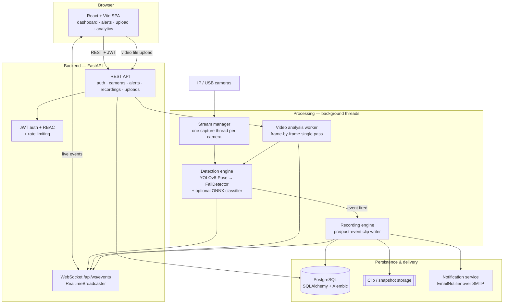

<div align="center">

# SentinelCam

**AI-powered fall detection and video surveillance platform — live multi-camera monitoring,
offline video analysis, and realtime alerts, built on YOLO computer vision with a
production-oriented full-stack architecture.**

[](https://github.com/longlivewama/SentinelCam/actions/workflows/ci.yml)
[](LICENSE)
[](https://www.python.org/)
[](https://fastapi.tiangolo.com/)
[](https://react.dev/)
[](https://www.postgresql.org/)
[](https://docs.docker.com/compose/)
[](https://docs.ultralytics.com/)
[](#testing)

</div>

---

## Table of contents

- [Overview](#overview)
- [Features](#features)
- [Architecture](#architecture)
- [Tech stack](#tech-stack)
- [Project structure](#project-structure)
- [Quick start](#quick-start)
- [Local development (without Docker)](#local-development-without-docker)
- [Configuration](#configuration)
- [Testing](#testing)
- [Machine learning: models & datasets](#machine-learning-models--datasets)
- [Engineering notes & design decisions](#engineering-notes--design-decisions)
- [Security](#security)
- [Roadmap](#roadmap)
- [Known limitations](#known-limitations)
- [Production deployment](#production-deployment)
- [Troubleshooting](#troubleshooting)
- [Contributing](#contributing)
- [License](#license)

---

## Overview

Falls are one of the leading causes of injury-related hospitalisation for older adults, and in
care homes, hospitals and industrial sites the cost of a fall is driven far less by the fall
itself than by **how long the person lies there before anyone notices**. Camera coverage in those
buildings is usually already in place — what is missing is something watching the feed.

SentinelCam is that layer. It ingests video from IP/USB cameras (or from an uploaded file),
runs pose-based computer vision over the frames, and when it detects a fall it does the three
things a human operator would: records a clip of what just happened, raises an alert in the
dashboard in realtime, and emails the on-call recipients.

**How it works, end to end:**

1. A camera stream (or an uploaded video) is decoded frame by frame.
2. Each frame goes through YOLOv8 pose estimation to extract human keypoints.
3. A fall detector evaluates posture, keypoint alignment and hip velocity, and only fires after
   an on-ground posture is **sustained** for ≥1.2 s — so bending down or sitting doesn't trigger it.
4. A firing event snapshots a rolling pre-event buffer, appends post-event frames, and writes a
   playable MP4 clip plus a still snapshot.
5. The event is persisted, pushed to every connected browser over a WebSocket, and emailed out.
6. Operators review, play back and acknowledge alerts from the web UI.

The same detection code path serves both live cameras and uploaded files — only the frame source
and the timeline differ — which is what keeps the "analyse this video" feature honest: it is the
production detector running, not a separate demo path.

> **Scope note.** This is an engineering project, not a certified medical or safety device. The
> fall detector is a well-tuned heuristic over a production pose model, with a trained
> corroborating classifier and a YOLO fall detector in the pipeline. Accuracy claims are kept
> deliberately narrow throughout this README and in [`ml/README.md`](ml/README.md).

---

## Features

### Detection & video

| Feature | Status |
|---|---|
| Live multi-camera monitoring (RTSP IP cameras and USB devices) | ✅ |
| MJPEG live stream, one capture connection shared across all viewers | ✅ |
| Pose-based fall detection with a sustained-posture gate | ✅ |
| Additional heuristic detectors: violence, crowd density, abandoned object | ✅ (heuristics — see [notes](#engineering-notes--design-decisions)) |
| Automatic clip recording with a ~3 s pre-event rolling buffer | ✅ |
| Snapshot capture attached to every event | ✅ |
| Offline video upload with drag-and-drop, client-side validation and progress tracking | ✅ |
| Server-side analysis of uploaded video through the same detector | ✅ |
| Per-event confidence scores | ✅ |
| Ranged video playback and clip download | ✅ |

### Application platform

| Feature | Status |
|---|---|
| JWT authentication — signup, login, logout, forgot/reset password | ✅ |
| Role-based access control: `admin` / `operator` / `viewer`, enforced server-side | ✅ |
| Protected frontend routes + role-aware navigation | ✅ |
| Realtime updates over WebSocket (alerts, camera status, upload progress) | ✅ |
| Email notifications (SMTP), with SMS/WhatsApp notifier interfaces stubbed | ✅ / 🧩 |
| Alert acknowledgement workflow | ✅ |
| Dashboard analytics — event counts, trends, per-camera breakdown | ✅ |
| Admin user management (create, disable, change role) | ✅ |
| System status page (database, detector, storage) | ✅ |
| Per-IP rate limiting on all sensitive auth endpoints | ✅ |
| Alembic database migrations, including a data-preserving RBAC migration | ✅ |
| Responsive UI with toast notifications and graceful error states | ✅ |
| One-command Docker Compose stack (Postgres + backend + frontend + mail catcher) | ✅ |
| CI pipeline: lint, backend, frontend, end-to-end and dependency-audit jobs | ✅ |

---

## Architecture



**Request/authentication path.** JWT (24 h expiry) with bcrypt-hashed passwords. Password reset
uses one-time SHA-256-hashed tokens emailed to the user — the raw token is never persisted. Every
protected route accepts the token either as an `Authorization: Bearer` header (all JSON API calls)
or as a `?token=` query parameter, because browsers cannot attach custom headers to ``,
`<video src>`, `<a href>` downloads or the native WebSocket API — so the MJPEG stream, video
playback, downloads and the realtime socket authenticate via the URL instead.

**Authorization.** Three roles enforced by FastAPI dependencies (`require_admin`,
`require_operator`) on every mutating endpoint. `admin` has full access including user management;
`operator` manages cameras, acknowledges alerts and analyses video; `viewer` is read-only plus
upload/analysis. The frontend's route guards and hidden buttons are a UX convenience, **not** the
security boundary.

**Streaming.** Each camera gets one lazily-started background thread owning the
`cv2.VideoCapture` connection. It decodes frames and keeps the latest JPEG in a shared buffer,
which `/stream` serves as `multipart/x-mixed-replace` to any number of simultaneous viewers —
without opening a second capture connection per viewer.

**Recording.** That same thread keeps a rolling buffer of the last ~3 seconds of raw frames. When
a detector fires, the recording engine snapshots the buffer, appends ~3 more seconds of live
frames, and writes the combined clip (`avc1`/H.264, falling back to `mp4v`), records it in the
database, and dispatches an email alert with the snapshot attached.

**Realtime.** An in-process pub/sub broadcaster over a single WebSocket endpoint lets background
worker threads push `alert.created`, `camera.status`, `upload.progress` and `upload.completed`
events to every connected tab instantly — no polling.

---

## Tech stack

| Layer | Technologies |
|---|---|
| **Frontend** | React 18, Vite 5, Tailwind CSS 3, Zustand, React Router, Axios |
| **Backend** | Python 3.11, FastAPI, Uvicorn, Pydantic v2, SQLAlchemy 2.0, Alembic |
| **Database** | PostgreSQL 16 |
| **Computer vision** | Ultralytics YOLOv8 (pose + object detection), OpenCV |
| **ML runtime** | PyTorch (training), ONNX Runtime (inference) |
| **Realtime** | WebSocket (FastAPI/Starlette) |
| **Auth** | JWT (python-jose, HS256), bcrypt via passlib |
| **Testing** | pytest, Vitest + Testing Library, Playwright |
| **Tooling / CI** | Docker & Docker Compose, nginx, GitHub Actions, ruff, ESLint |

---

## Project structure

```
SentinelCam/
├── backend/                  FastAPI service
│   ├── app/
│   │   ├── api/routes/       auth, cameras, alerts, recordings, video_uploads,
│   │   │                     analytics, admin, realtime, system
│   │   ├── core/             security, RBAC dependencies, rate limiting
│   │   ├── models/           SQLAlchemy models (user, camera, event, recording, …)
│   │   ├── schemas/          Pydantic request/response schemas
│   │   ├── services/         detection engine, stream manager, recording engine,
│   │   │                     video analysis, realtime broadcaster, notifications
│   │   ├── config.py         environment-driven settings
│   │   └── main.py           application entrypoint
│   ├── alembic/              database migrations
│   ├── tests/                69 backend tests (pytest, real PostgreSQL)
│   └── Dockerfile
├── frontend/                 React + Vite single-page app
│   ├── src/
│   │   ├── pages/            dashboard, cameras, alerts, recordings, upload,
│   │   │                     analytics, admin users, auth pages
│   │   ├── components/       route guards, camera tiles, charts, modals, toasts
│   │   ├── store/            Zustand stores (auth, toasts, alert badge)
│   │   ├── lib/              realtime client, formatting, upload validation
│   │   └── api/              Axios client with auth interception
│   ├── nginx.conf            production static-serving config
│   └── Dockerfile
├── ml/                       standalone ML pipeline (not imported by the app)
│   ├── detector/             YOLO fall-detector: dataset download, analysis,
│   │                         preparation and training scripts
│   ├── scripts/              keypoint-feature dataset builders
│   ├── exported/             committed model artifact + metadata (ONNX)
│   ├── train.py evaluate.py export.py
│   └── README.md             full methodology, evaluation and honest caveats
├── e2e/                      Playwright suite driving the real Docker stack
│   ├── tests/                auth, cameras, alerts/recordings, upload
│   └── fixtures/             test media
├── .github/workflows/ci.yml  backend · frontend · e2e · dependency-audit jobs
├── docker-compose.yml        Postgres + backend + frontend + Mailpit
└── .env.example              documented configuration template
```

---

## Quick start

### Prerequisites

- [Docker](https://docs.docker.com/get-docker/) and Docker Compose

That's it — Postgres, the backend, the built frontend and a mail catcher all come up together.

### 1. Clone

```bash
git clone https://github.com/longlivewama/SentinelCam.git
cd SentinelCam
```

### 2. Configure (optional)

Every value has a working local default. To override any of them:

```bash
cp .env.example .env      # then edit as needed
```

Set a real `JWT_SECRET_KEY` for anything beyond a local trial:

```bash
python3 -c "import secrets; print(secrets.token_hex(32))"
```

### 3. Start the stack

```bash
docker compose up --build
```

### 4. Create the first admin user

In a second terminal, once the stack is healthy:

```bash
docker compose exec backend python seed_admin.py
```

### 5. Open the app

| Service | URL |
|---|---|
| Web UI | http://localhost:5173 |
| API + interactive docs | http://localhost:8000 · http://localhost:8000/docs |
| Mailpit (catches alert & password-reset email) | http://localhost:8025 |

Log in, then either add a camera (an `rtsp://…` URL, or a device index like `0` for a USB
webcam) from the **Cameras** page, or go straight to **Upload** and analyse a video file — no
camera hardware required.

> **Camera access from inside Docker** is host-OS dependent. Linux can pass a USB device through
> with `devices:` in `docker-compose.yml`; Docker Desktop on macOS/Windows generally cannot. RTSP
> IP cameras work over the network regardless. For local USB webcam testing, run the backend
> outside Docker (below).

Recordings, snapshots and uploads persist in named Docker volumes across restarts.
`docker compose down -v` wipes them along with the database.

---

## Local development (without Docker)

**Prerequisites:** Python 3.11+, Node 20.18+ (Node 22 recommended — jsdom 30 needs a recent
Node to run the frontend tests), and a local PostgreSQL server.

```bash
# 1. Databases
createdb sentinelcam
createdb sentinelcam_test          # only needed for the backend test suite

# 2. Backend
cd backend
python3 -m venv venv && source venv/bin/activate
pip install -r requirements.txt
cp .env.example .env               # fill in DATABASE_URL, JWT_SECRET_KEY, SMTP_* …
alembic upgrade head               # apply the schema
python seed_admin.py               # create the first admin user
uvicorn app.main:app --reload      # http://localhost:8000  (docs at /docs)

# 3. Frontend (separate terminal)
cd frontend
npm install
cp .env.example .env               # VITE_API_URL=http://localhost:8000
npm run dev                        # http://localhost:5173
```

### Database migrations

Schema changes are managed with Alembic; `alembic upgrade head` is the production migration path.

```bash
cd backend
alembic upgrade head                                      # apply pending migrations
alembic revision --autogenerate -m "describe the change"  # after changing a model
```

`Base.metadata.create_all()` also runs once on startup as a convenience for fresh dev databases —
it only ever *adds missing tables* and never alters existing ones, so it is a safety net, not a
substitute for migrations against a database that already holds data.

---

## Configuration

All configuration is read from the environment. Never hardcode credentials — every real `.env`
file is gitignored, and only `.env.example` templates are committed.

| Variable | Purpose |
|---|---|
| `DATABASE_URL` | PostgreSQL connection string |
| `JWT_SECRET_KEY` | JWT signing secret. The app **refuses to start** if left at its insecure default while `ENVIRONMENT=production` |
| `CORS_ORIGINS` | Comma-separated allowed frontend origins |
| `FRONTEND_URL` | Base URL used to build links in emails (e.g. password reset) |
| `NOTIFICATION_CHANNELS` | Comma-separated enabled channels (`email` works out of the box) |
| `SMTP_*`, `ALERT_RECIPIENTS` | Email delivery configuration |
| `UPLOADS_DIR`, `MAX_UPLOAD_SIZE_MB`, `ALLOWED_VIDEO_EXTENSIONS` | Video upload limits |
| `FALL_CLASSIFIER_MODEL_PATH` | Optional path to the exported ONNX classifier (empty = heuristic-only, the default) |
| `AUTH_*_MAX_REQUESTS` / `AUTH_*_WINDOW_SECONDS` | Per-IP rate limits on signup, login, forgot-password and reset-password |
| `VITE_API_URL` *(frontend)* | Backend base URL; the WebSocket URL is derived from it automatically |

The full commented list lives in [`.env.example`](.env.example),
[`backend/.env.example`](backend/.env.example) and `frontend/.env.example`.

---

## Testing

**142 automated tests across three suites**, all currently passing, plus a four-job CI pipeline.

| Suite | Count | What it covers |
|---|---:|---|
| **Backend** (pytest) | **69** | Security primitives, fall-detection logic, classifier, auth & RBAC, cameras, alerts, recordings, video uploads, analytics, system status, rate limiting, Alembic migrations, email notifier, WebSocket auth, and one real end-to-end video analysis through actual YOLO inference |
| **Frontend** (Vitest + Testing Library) | **57** | Auth pages, route guards, upload workflow (drag-drop, validation, progress, delete), dashboard, Zustand stores |
| **End-to-end** (Playwright) | **16** | Real Chromium against the real Docker Compose stack — signup, login, logout, forgot/reset password (reading the actual email out of Mailpit's API), camera CRUD + RBAC, alert acknowledgement, recording playback, and the full upload → process → view-results workflow |
| **Docker** | 4 services | `postgres`, `backend`, `frontend`, `mailpit` — all healthy under `docker compose up` |

```bash
# Backend — runs against a real PostgreSQL database, not a mock
cd backend && source venv/bin/activate
createdb sentinelcam_test        # one-time
pytest
ruff check .

# Frontend
cd frontend
npm run lint && npm run test && npm run build

# End-to-end (brings the Docker stack up, seeds fixtures, runs, tears down)
cd e2e
npm install
npx playwright install --with-deps chromium   # one-time
npm test
```

Backend tests deliberately run against real Postgres rather than a sqlite substitute — the app
relies on Postgres-specific behaviour (boolean filters, timezone-aware timestamps) in enough
places that sqlite would give false confidence.

No coverage percentage is published here, because none has been measured.

---

## Machine learning: models & datasets

The `ml/` directory is a **standalone training pipeline**. It is not imported by the running
backend — it produces model artifacts the backend can optionally load. Two tracks live there:

### 1. Keypoint fall classifier (shipped artifact)

- **Task:** binary classification over pose-keypoint features.
- **Why keypoints, not raw images:** a small feature-based model trains and runs cheaply on CPU,
  and is far less prone to memorising backgrounds than an image classifier on a small dataset.
- **Artifacts:** [`ml/exported/fall_classifier_v1.onnx`](ml/exported/) plus metadata **are
  committed** — they are small and are the deliverable of that pipeline.
- **Integration:** set `FALL_CLASSIFIER_MODEL_PATH` to the ONNX file. It acts only as a confidence
  adjustment on top of the heuristic's sustained-duration gate — it can never bypass that gate.
- **Honesty caveat:** its headline metrics come from a small, narrow, largely synthetic dataset
  and are explicitly flagged in [`ml/README.md`](ml/README.md) as likely inflated by
  domain-shortcut learning. Treat it as an experimental corroborating signal, not a validated
  production model.

### 2. YOLO fall detector (in progress)

- **Task:** single-class (`Fall`) object detection.
- **Model family:** YOLOv8n, fine-tuned from COCO pretrained weights at 640 px.
- **Why nano:** deployment is CPU-bound and already runs two YOLO models per frame per camera; the
  dataset analysis showed one class, a median of one object per image, and ~82 % "large" objects by
  COCO convention — capacity is not the binding constraint, data quality is. A YOLOv8s run exists
  as a controlled comparison so the size choice rests on a measurement, not an assumption.
- **Dataset:** a public Roboflow fall-detection export, downloaded and prepared by
  `ml/detector/download_dataset.py` and `ml/detector/prepare_dataset.py`, with a dataset analysis
  report generated before any training decisions were made.
- **Augmentation, chosen from that analysis rather than defaults:** the class is defined by
  *orientation relative to gravity*, so vertical flips are disabled outright and rotation/shear are
  kept near zero — augmentations that rotate an upright person toward horizontal would manufacture
  false positives in the training signal. Horizontal flip is kept (a fall is left-right symmetric).
- **Training workflow:** `download_dataset.py` → `analyze_dataset.py` → `prepare_dataset.py` →
  `train.py`, with a stratified smoke-test subset available for fast iteration before a full run.

### What is and is not in this repository

| Artifact | In Git? | Why |
|---|---|---|
| Keypoint-classifier training, evaluation and export **source code** | ✅ | The reproducible part |
| YOLO detector pipeline source (`ml/detector/`) | ⏳ | Lands with the completed training run |
| Exported keypoint classifier (`ml/exported/*.onnx`, `*.pt`, metadata) | ✅ | Small, and the actual deliverable |
| Training **datasets** (`ml/data/…`) | ❌ | Large and redistributable only under their own licences — re-fetch with the download scripts |
| Training **runs & checkpoints** (`ml/runs/`) | ❌ | Large binaries; a selected artifact gets promoted to `ml/exported/` instead |
| Training **logs** (`ml/logs/`) | ❌ | Machine-local noise |
| Auto-downloaded YOLO base weights (`*.pt` at repo root) | ❌ | Fetched on demand by Ultralytics |

So: **the trained YOLO fall-detector weights are intentionally not distributed here.** Reproduce
them with the scripts in `ml/detector/`, or point the backend at your own artifact. That detector
pipeline is under active development and lands in this repository together with the results of its
first full training run — the section above describes design decisions already made and measured,
not code you can run from a fresh clone today.
See [`ml/README.md`](ml/README.md) for the full methodology, dataset licences, split strategy and
evaluation discussion.

---

## Engineering notes & design decisions

Three of the four live-camera detectors were specified against research-grade models that require
specific datasets and substantial GPU time (RWF-2000 for violence, ShanghaiTech/CSRNet for crowd
density, DeepSORT for tracking). Rather than ship an untrained model behind a confident-sounding
name, each was implemented as a practical, honestly-scoped equivalent that satisfies the same
interface and can be swapped later **without touching the rest of the system**:

| Detector | Research-grade approach | What is actually implemented | Upgrade path |
|---|---|---|---|
| **Fall** | YOLOv8-Pose, 3-signal heuristic | Pose heuristic (aspect ratio / keypoint alignment / hip velocity) gated by a sustained on-ground-posture requirement (≥1.2 s continuous, not a single frame) to reject bending and sitting, plus an optional trained classifier as a corroborating signal | Retrain on real footage; add the YOLO fall detector from `ml/detector/` |
| **Violence** | CNN+LSTM trained on RWF-2000 | Heuristic over the same pose keypoints: erratic high-velocity wrist/elbow motion between people in close proximity | Swap in a trained temporal model via `VIOLENCE_MODEL_PATH` |
| **Crowd counting** | CSRNet density-map estimation | YOLOv8 person-class detection and count, smoothed over frames, thresholded per camera | Swap in CSRNet for very dense or occluded scenes |
| **Abandoned object** | YOLO + DeepSORT | YOLO object detection plus a small centroid tracker | Swap in DeepSORT/ByteTrack for robust ID persistence through occlusion |

Other decisions worth calling out:

- **One capture thread per camera, not per viewer** — the naive implementation opens a new
  `VideoCapture` per connected browser and collapses at three viewers.
- **Sustained-posture gating over per-frame classification** — a single-frame "on the ground"
  signal fires constantly on people bending, sitting and crouching. The time gate is what makes
  the alert stream usable.
- **Shared detection path for live and uploaded video** — the upload feature runs the production
  detector against the file's own timeline, so it is a genuine test of the real pipeline.
- **Notifier interface with real stubs** — `SmsNotifier` and `WhatsAppNotifier` log an explicit
  "not configured" warning rather than silently no-op, so wiring a real provider later is a config
  change plus one class, not a call-site rewrite.

---

## Security

- **Secrets live in environment variables only.** No credential is committed; every real `.env`
  is gitignored and only documented `.env.example` templates ship with the repository.
- **Production start-up guard.** The backend refuses to boot with `ENVIRONMENT=production` while
  `JWT_SECRET_KEY` is still the insecure default.
- **Authentication.** JWT with bcrypt-hashed passwords. Password-reset tokens are single-use and
  stored only as SHA-256 hashes — the raw token exists solely in the email.
- **Authorization.** Role checks are enforced server-side on every mutating endpoint; the frontend
  guards are UX, not security.
- **Rate limiting.** Per-IP sliding-window limits on signup, login, forgot-password and
  reset-password, all tunable via environment variables.
- **Dependency auditing.** `pip-audit` and `npm audit` run on every CI build (informational, so a
  new advisory surfaces for review rather than silently blocking unrelated work).
- **For production deployments,** use a managed secret store (AWS Secrets Manager, GCP Secret
  Manager, Vault, or your platform's equivalent) rather than `.env` files on disk, terminate TLS at
  a reverse proxy, and restrict `CORS_ORIGINS` to your real frontend origins.

Found a vulnerability? Please report it privately — see [SECURITY.md](SECURITY.md). Do not open a
public issue for security reports.

---

## Roadmap

Planned work, none of it implemented yet:

- [ ] **Persist in-video fall timestamps** so uploaded-video results can deep-link to the exact
      moment of each detection.
- [ ] **Finish and integrate the YOLO fall detector** as a first-class detector alongside the pose
      heuristic, with a published held-out evaluation.
- [ ] **Inference performance** — batched/strided frame processing and optional GPU acceleration
      for faster analysis of long recordings.
- [ ] **Horizontally scalable realtime** — move the rate limiter and event broadcaster to Redis so
      the backend can run multiple workers or instances.
- [ ] **Richer analytics** — per-camera heatmaps, time-of-day distributions, exportable reports.
- [ ] **More notification channels** — SMS and WhatsApp providers behind the existing interfaces.
- [ ] **Observability** — structured logging, metrics and health dashboards.
- [ ] **Model version management** — track, compare and roll back deployed detector versions.
- [ ] **Deployment reference** — a documented production deploy (managed Postgres, object storage
      for clips, TLS termination).

---

## Known limitations

Stated plainly, because they matter when reading the rest of this document:

1. **In-video fall offsets are not persisted.** An analysed upload reports *that* a fall was
   detected and produces the clip, but the exact in-video timestamp is not stored on the event
   record, so the UI cannot yet seek to it.
2. **Deleting a video while it is being analysed is an unresolved backend race.** The analysis
   worker and the delete endpoint can interleave; the failure is contained (the worker records a
   failed status rather than crashing the service), but the correct fix — cooperative cancellation
   of the worker — is not implemented.
3. **Analysis duration varies with machine load.** Everything here is CPU-verified with no GPU
   requirement, so wall-clock analysis time for a given video depends heavily on what else the
   host is doing.
4. **Violence, crowd and abandoned-object detectors are heuristics**, not trained models — a known
   and documented scope boundary, not an accidental gap.
5. **The fall classifier's metrics are optimistic.** Small, narrow, largely synthetic dataset; see
   [`ml/README.md`](ml/README.md).
6. **Single-process assumptions.** The in-memory rate limiter and realtime broadcaster are
   per-process; multi-worker deployment needs a shared backing store.
7. **E2E coverage boundaries.** The Playwright suite does not cover live-camera streaming (no
   camera hardware in CI) or a genuine ML-detected fall — its upload fixture is deliberately
   person-free so the assertion stays honest. Both were verified manually in a real browser.
8. **Two residual dependency advisories are accepted rather than force-fixed:** `ecdsa` (reachable
   only via ECDSA JWT algorithms; this app uses HS256 exclusively) and `pyasn1` (pinned by
   `python-jose`'s own constraint). Both are documented rather than hidden.
9. **Untested externally:** a real RTSP IP camera (verified against a USB webcam instead), and
   real SMTP delivery (verified against Mailpit).

---

## Production deployment

1. Set `ENVIRONMENT=production` and a real random `JWT_SECRET_KEY` — the app refuses to boot
   otherwise.
2. Run `alembic upgrade head` against the production database as a deploy step; do not rely on
   `create_all`.
3. Run the backend behind a real ASGI configuration (`uvicorn app.main:app --workers N` behind a
   reverse proxy). Note that the in-memory rate limiter and realtime broadcaster are per-process —
   scaling past one worker needs a shared store (see the docstrings in `app/core/rate_limit.py`
   and `app/services/realtime.py`).
4. Serve the frontend build (`frontend/dist/`) from a static host or CDN, with `VITE_API_URL`
   baked in at build time.
5. Configure real SMTP credentials for `NOTIFICATION_CHANNELS=email`, and set `CORS_ORIGINS` to
   your real frontend origins.

### External services you will need for full functionality

| Dependency | Needed for | Without it |
|---|---|---|
| SMTP credentials | Alert and password-reset email | Logs a warning and continues — everything except delivery works |
| An RTSP/IP or USB camera | The live-camera pipeline | Video upload and analysis still work end to end |
| SMS / WhatsApp provider | Those notification channels | Stubs log "not configured"; no silent failures |
| A GPU | Faster inference and training | Everything here is CPU-verified; a GPU is an optimisation, not a requirement |

---

## Troubleshooting

| Symptom | Cause and fix |
|---|---|
| `JWT_SECRET_KEY is still set to its insecure default` on boot | `ENVIRONMENT=production` with the placeholder secret. Generate one: `python3 -c "import secrets; print(secrets.token_hex(32))"` |
| `alembic upgrade head` fails on a fresh database | `DATABASE_URL` must point at a database that already exists (`createdb sentinelcam`) with table-creation privileges |
| Live camera stream never loads | Check the camera `url` (numeric string for a USB index, full `rtsp://…` for IP) and the backend log for `cv2.VideoCapture` open failures. The tile degrades to "Stream unavailable" rather than breaking the page |
| Recording won't play in Safari | Check which codec the backend logged — `mp4v` (the fallback) is far less broadly compatible than `avc1` |
| Uploaded video stuck at "processing" | `video_analysis.py` records real failures as `status=failed` with an `error_message`, so a genuinely *stuck* item is usually a long file still processing on CPU |
| Realtime badge stays on "Reconnecting" | The WebSocket uses the same JWT as everything else — check expiry, then the backend log for the `/api/ws/events` connection attempt |
| `pytest` fails with a connection error | `createdb sentinelcam_test` first; the suite needs a real reachable Postgres at the `DATABASE_URL` its `conftest.py` defaults to |

---

## Contributing

Contributions are welcome. Please read [CONTRIBUTING.md](CONTRIBUTING.md) for the development
setup, coding conventions, commit-message format and the checks a pull request must pass.

## License

Released under the [MIT License](LICENSE).

Third-party models and datasets carry their own licences — in particular, Ultralytics YOLOv8 is
AGPL-3.0 licensed, and the fall-detection dataset is governed by the terms of its Roboflow export.
See [NOTICE.md](NOTICE.md) and review those terms separately before any commercial use.
